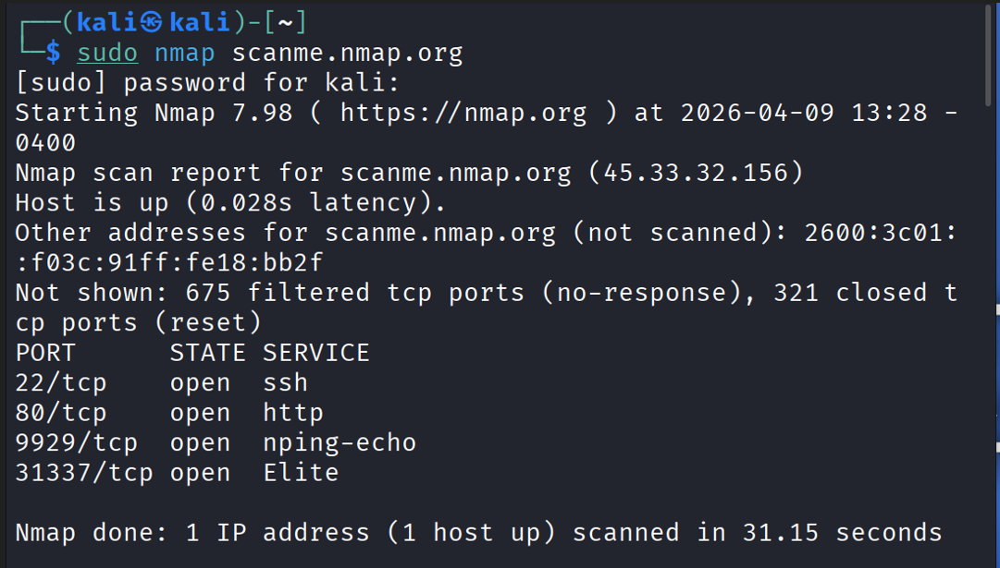
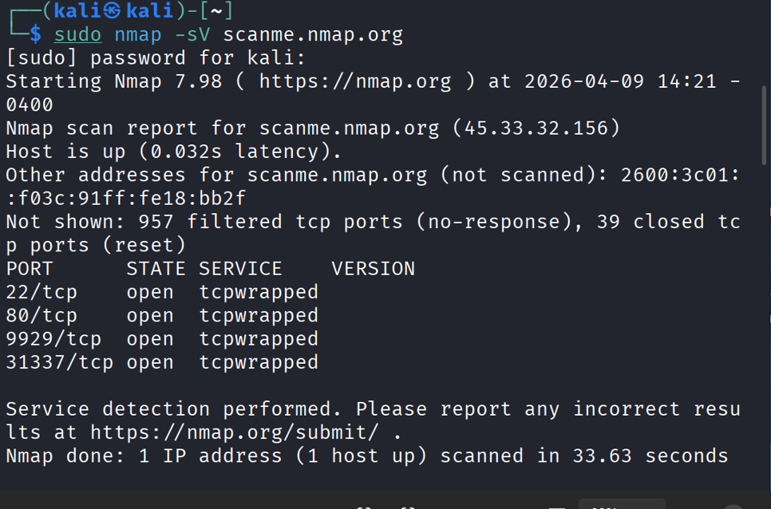
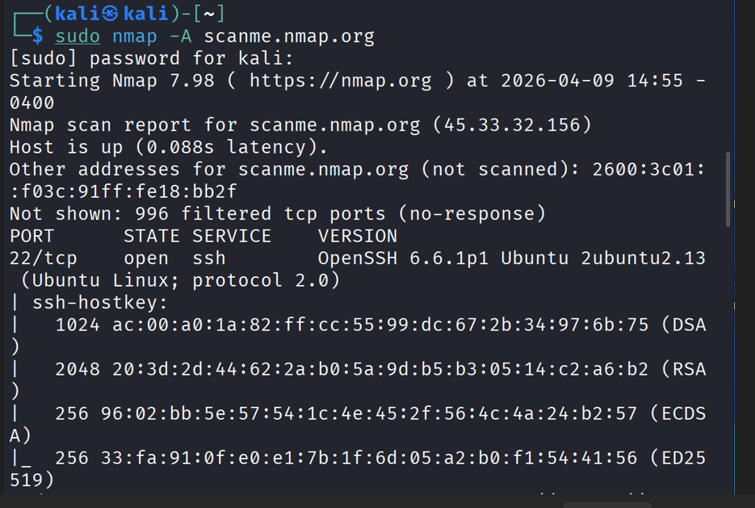

# Project 01 - Basic Network Scan (Nmap)

## Objective
Perform a basic network scan to identify open ports and services.

## Tool Used
- Nmap

## Target
scanme.nmap.org

## Command Used
1. Basic Scan:
nmap scanme.nmap.org
2. Service Version Detection:
nmap -sV scanme.nmap.org
3. Aggressive Scan:
nmap -A scanme.nmap.org

## Methodology
1. Performed an initial scan to identify open ports on the target system.
2. Conducted service version detection to gather information about running services.
3. Executed an aggressive scan to obtain detailed system and service information.
4. Analyzed the results to identify potential security risks and unusual services.

## Scan Results
(See scan-results.txt)

## Screenshots

1. Basic Scan  

2. Service Version Detection  

3. Aggressive Scan  

## Findings
- Host is up with low latency (28ms)
- 4 open ports detected:
  - 22 (SSH)
  - 80 (HTTP)
  - 9929 (Nping service)
  - 31337 (Unusual service)

## Analysis
- Port 22 (SSH): Allows remote access. This service should be secured to prevent unauthorized login attempts.
- Port 80 (HTTP): Indicates a web server is running. Web services should be checked for common vulnerabilities.
- Port 9929: Identified as Nping service, typically used for testing. Not commonly found in production environments.
- Port 31337: Uncommon port. Could be associated with a custom or non-standard service and requires further investigation.

## Conclusion
The target exposes multiple services, increasing the attack surface.

----------------------------------------------------
## Service Version Scan (-sV)

### Observation
- All ports show "tcpwrapped"
- No version information detected

### Analysis
- "tcpwrapped" means the service is protected or not revealing its details
- This usually happens due to firewall rules or access restrictions

### Insight
- Basic scan showed service names (ssh, http)
- Version scan hid details → indicates defensive mechanism

### Conclusion
The target is limiting service information exposure, which is a security measure to reduce attack surface.

--------------------------------------------
## Aggressive Scan (-A)

### Observation
- Service versions detected:
  - OpenSSH 6.6.1p1
  - Apache 2.4.7
- OS detected as Linux
- Additional details like SSH keys and HTTP title obtained

### Analysis
- Older versions of SSH and Apache may contain vulnerabilities
- Aggressive scan reveals more information compared to basic and -sV scans
- Firewall restrictions can be bypassed using deeper scan techniques

### Insight
Different scan types provide different levels of visibility:
- Basic scan → Ports only
- -sV → Limited info (sometimes blocked)
- -A → Detailed system and service information

### Conclusion
Aggressive scanning provides a complete attack surface, helping identify potential vulnerabilities and system details.
